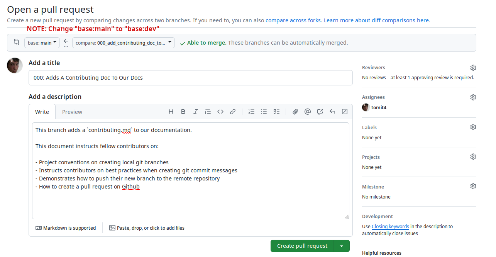

# Contribution Guidelines

## Introduction

First and foremost, thank you for contributing to Phlint App! This
document covers conventions and guidelines on how best to make coding
contributioins to Phlint App. While not strictly enforced rules, these
guidelines are meant to provide you with essential standards and practices
common to Open Source Contributions.

## Tickets, Issues, And Bug Fixes

Prior to starting to write code, make sure you're addressing something the
Project Maintainers have determined the project <em>needs</em>. Tickets are
raised based off of needs raised by the Project Lead or Maintainers. Tickets
are also raised by Issues and/or Bugs noticed within the App and then posted
here on Github. Once a Ticket is produced, it's <em>Ticket Number</em> is
assigned to the Issue/Bug here on Github.

Should you volunteer or be assigned to address said Ticket, your Github Handle
will be assigned to the Ticket and Issue, and you will officially be held
responsible for addressing said Ticket/Issue until it is either resolved or you
wish to no longer hold said responsibility and let the Project Lead and other
maintainers know. Once you have taken responsibility for the ticket, please
communicate on the Project Discord roughly how long you project it will take you
to resolve the Ticket, and should you need additional time, please communicate
that as you progress.

## Git Branches

Once you have taken a ticket, ensure that you first pull in the latest updates
from the `dev` branch. While within the project directory in your development
environment, pull the updates with the `git pull` command:

```sh
git pull origin dev
```

This will ensure that prior to the start of your work, you have all of the
latest updates of the project on your development machine. Next you'll want to
start a new branch and change your development environment to work within that
branch. Naming your new branch should reflect the Ticket/issue. Convention
encouraged for this practice should include the <em>Ticket Number</em> and the
<em>Issue Adddressed</em>. An example of a Ticket with number `001`, Issue Name
`add signup to auth` would look like this:

```sh
001_add_signup_to_auth
```

Therefore, creating a new branch and then changing the development environment
to this branch would utilize the `git checkout` command with the `-b` flag like
so:

```sh
git checkout -b 001_add_signup_to_auth
```

Once within this git branch, you can now start writing code to address this
ticket/issue.

**Commit Messages:**

As you progress through coding for Phlint, you'll want to keep your code
relegated towards the Issue or Feature you are addressing. Common convention
regarding commit messages is that you should commit <em>often</em>. Even if
your commit is rather mundane, like making a small note or just saving
your progress, committing more often is almost always better than committing
less often. This is because a series of commit messages, even if
redundant, can later be <em>squashed</em> to be more concise, but a single
commit with a series of unrelated code can often leave those reading through the
git history questioning exactly what is happening.

A simple commit message will look like:

```sh
git commit -m "Refactored set_cookie function, httponly to false"
```

Commit messages should always start with a <em>capitalized</em> letter, and
should ideally be kept to less than 50 characters. It is important that your
commit messages inform others who might be reading the git history of the
project what was done specifically in that commit. Should you need to simply
save your work, try your best to cover what you are in the middle of. Even a
simple commit message like this:

```sh
git commit -m "Continuing to refactor set_cookie function, in progress"
```

Let the reader know what you are working on and that the work is, at that time,
not finished. As mentioned earlier, these commits can always be squashed
into one more generalized commit later on during the development lifecycle.

Here I'll make a brief mention on other issues that innevitably come up during coding.
Should you come across any featues/bugs that are unrelated to the Ticket/Issue, simply make a
note of them using `TODO:` or `NOTE:` comments, and create a specific commit
that addresses that unrelated issue. The following example illustrates this
practice:

```python
# TODO: Address Bug that occurs here where signup fails
```

Lastly, you'll notice that other developers working on Phlint make use of Emojis
in their commit messages. This is an aesthetic choice, as emojis can sometimes
be used to give a visual indicator of what kind of ticket/issue this commit
makes. Use of emojis (or "gitmojis") is <em>not</em> a requirement when
committing to Phlint, but should you wish to use them, you can find a small
guide [here](https://gitmoji.dev/). Emojis are added usually to the beginning of
your commit message and do <em>not</em> count towards the 50 character limit.
Here is an example of one in use:

```sh
git commit -m ":recycle: Refactored set_cookie function, httponly to false"
```

Note that you can have multiple commits made before `pushing` your commit up to
the remote repository here on Github. You do <em>not</em> need to push every
time you make a commit, just push up to the repository when you feel you wish to
save to the remote. Also note that until your branch is pulled into `dev`, that
you can safely leave unfinished work in your branch, pushed up to GitHub without
fear of altering the `dev` branch. One of the nice things about working with
`git` is that it is relatively easy to revert back changes and to fix version
related issues, so don't be afraid of altering the `dev` codebase, the Project
Lead will let you know if a branch still needs work before being pulled into the
`dev` branch!

## Creating A Pull Request

Once you have made what you deem to be a significant amount of work done on the
Ticket/Issue, you can create a Pull Request on Github so that the Project Lead
can see your progress, give advice, refactor code, etc. If the Project Lead
determines your Ticket is Resolved, they will approve your pull request.

To create a pull request, you'll first need to set the upstream remote, `origin`,
so that a remote branch is created to mirror the local branch you created:

```sh
git push --set-upstream origin 001_add_signup_to_auth
```

You'll then be instructed to `Create a pull request` on Github, by visiting a
url:

```
https://github.com/cafeDeDevs/phlint_app/pull/new/001_add_signup_to_auth
```

Visit this page, where you'll be presented with a Pull Request template:


Of importance is the header above the title, which shows which branch you wish
to merge your development branch with. Usually this is the `main` branch when you
wish to push your changes to production, <em>but you should change the button
above that says <b>base:main</b> to read <b>base:dev</b></em>. This is because the Project
Lead will pull `dev` into `main` once a certain amount of Tickets are resolved. To reiterate,
<b>DO NOT CREATE A PULL REQUEST INTO MAIN, ALWAYS PULL REQUEST INTO DEV</b>, this is very important
as it protects our `main` branch should anything break within `dev`.

Should there be any conflicts within the merge, you will be notified in this section.

Within the title section, include the ticket number, as well as the ticket subject/issue
and/or bug fix. Within the description field, include a short description of
what this Ticket resolves or adds to the Phlint App Project. A short, bullet
point list is encouraged if the Ticket is particularly in depth or complex.
Lastly, before you click on the Green <em>Create pull request</em> button, make
sure to click the <em>Gear Icon next to the Assignees</em> field, you'll see a
drop down list of fellow Contributors presented to you. Most of the time, you'll
want to Assign the Pull Request to the Project Lead. In this case, that'd be me,
`tomit4`.

<em>Note that should you create a pull request priot to you believing that the work
you are doing is resolved, please prepend your title with the acronym `WIP:`
(aka Work In Progress). This let's the Project Maintainer know that you are
still working on this issue, and have simply created a Pull Request so that
others may keep track of your progress via git commits.</em>

Here is a screenshot of what a filled out Pull Request Form might look like:



Should you and/or the other contributors wish to comment on the pull request
prior to the pull request being approved, you can see comments by visiting the
Phlint App's [Github Repository](https://github.com/cafeDeDevs/phlint_app) and
visit the Pull Request Tab towards the top.

Should any changes to your code be requested prior to the Pull Request being
approved, you can simply continue to work on the code base on your local
development branch, add, commit, and push the code as per usual. Once the
requested changes have been made, there is no need to make another pull request,
simply make another comment on the pull request's page, letting the others on
your team know that the changes have been made. Should your changes be approved,
you'll see that this Pull Request is approved, merged into the `main` branch, and
resolved.

### Clean Up

<em>Once your Pull Request is finalized and finished</em>, you'll want to keep things
tidy by deleting the branch <em>both locally and remotely</em>. To delete the branch
remotely, invoke the following command:

```sh
git push -d origin <branch_name>
```

In the case of the aforementioned example, this would look like this:

```sh
git push -d origin 001_add_signup_to_auth_tomit4
```

You'll then want to remove the local branch on your development machine as well
like so:

```sh
git branch -d <branch_name>
```

Which, given our previous example, would look like this:

```sh
git branch -d 001_add_signup_to_auth_tomit4
```

<em>Note that you should not delete your branch prior to the pull request being
approved and pulled into `dev`! Should you delete your branch prior to merging
into `dev`, all work will be lost on the remote as well as your development
machine. If unsure, do not delete the branch until the Project Maintainer tells
you to do so</em>.

### A Word On Environment Variables

This section is less related to conventions around git and pull requests, but is
documented here as it is related to part of our development. Environment
Variables are secrets related to your a project's development that need to be
securely stored and kept private. This means that environment secrets <em>cannot
be pushed up to Github</em>. Common convention is to utilize packages like
[npm's dotenv](https://www.npmjs.com/package/dotenv), or
[python-dotenv](https://pypi.org/project/python-dotenv/) that allow one to include
aliases for sensitive secrets within the codebase.

These secrets are conventionally stored in a hidden `.env` file. In Phlint's
case, there is a `.env` file located in both the `backend` and `frontend`
directories, which holds environment secrets related to Phlint App.

In order to ensure these files are not pushed up to Github, you'll notice that
in the `root`, `backend`, and `frontend`, there is a hidden `.gitignore` file.
If you are unfamiliar with the conventions around the `.gitignore` file, please
read [this article from freecodecamp on the subject](https://www.freecodecamp.org/news/gitignore-what-is-it-and-how-to-add-to-repo/). Basically it prevents certain file types, directories,
and/or files from being pushed up to Github by default.

<em>DO NOT REMOVE ANY FIELDS CURRENTLY IN THE `.gitignore` files!</em> they are
<em>essential</em> to keeping our application's secrets private!

It is probable that eventually you might need to create a new environment variable,
especially when interacting with a new third party API. You can append to the
`.env` file whatever secrets related to the API you might need. An example of
this might include:

```
# S3 Credentials
S3_SIGNIN_KEY="94145jWMq2K1cxUh-PdEi"
```

In this example, we establish an environment variable calleed `S3_SIGNIN_KEY`.
Note the all capitalized syntax, this is common convention to differentiate it
as a constant. On Phlint's backend, you could then import it using python's
native `os` module, and also the `python-dotenv` library:

```python
import os
from dotenv import load_dotenv
signin_key = os.getenv('S3_SIGNIN_KEY')
```

Or on the frontend, there is a slight difference in that in using
[vite](https://vitejs.dev/), environment variables are prepended
using the `VITE_` syntax:

```
VITE_SECRET_KEY=Jk8LaCECLHxLEPCZ6Ltyg
```

And then imported like so:

```typescript
const secretKey = import.meta.env.VITE_SECRET_KEY;
```

Great! We now have secrets defined in our environment variables, and because the
`.gitignore` file prevents the committing of sensitive secrets up to Github, we
can write our code without fear of leaking sensitive information. But how do we
let other developers know about these new environment variables if they cannot
see them in the latest commits?

You'll notice in both the `frotend` and `backend` directories, there is a
provided `env-sample` file. In fact if you followed the [Initial Setup
Guide](https://github.com/cafeDeDevs/phlint_app/blob/main/docs/initial_setup.md),
you'll notice at one point during the setup we then copy these environment
variables to a `.env` file:

```sh
cp env-sample .env
```

This sample file is essentially the same as the `.env` file, but with the
secrets removed. This is so that we commit the fact that <em>a new environment
variable exists</em> to other developers, without giving away the secrets.
Within the fields provided in these `env-sample` files are the appropriate
<em>keys</em>(i.e. S3_SIGIN_KEY), but with either dummy data or no data at all
for their value. Hence the S3_SIGNIN_KEY example from above:

```
# .env
# S3 Credentials
S3_SIGNIN_KEY="94145jWMq2K1cxUh-PdEi"
```

Becomes in our `env-sample` file:

```
# env-sample
# S3 Credentials
S3_SIGNIN_KEY=""
```

We can then communicate with other developers what those secrets are over a more
secure communication channel so they can fill them in by hand. Providing the
changes to the `env-sample` file is an important part of contributing to Phlint
App, as it prevents confusion when other developers pull in changes from your
code and errors are thrown when certain environment variables are left
`undefined`.

### Conclusion

There is a lot this document doesn't cover when it comes to basic workflows
using Git and Github, but it is provided here so that you have a basic
understanding of a conventional workflow that we hope you will implement when
contributing to the Phlint App.

Thank you for taking the time to learn our best practices and conventions.
Should you have any questions or need help with a Pull Request, make sure to
reach out to the [Project Lead](https://github.com/tomit4).

Thank you for contributing to Phlint App!
